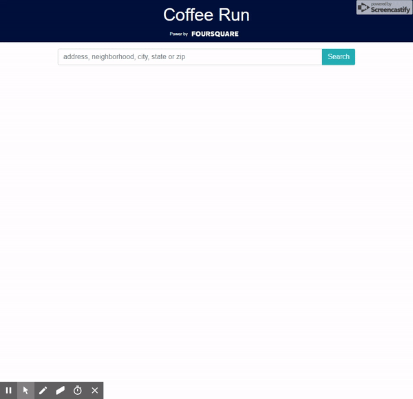

<h1 align="center">Coffee Run</h1>

<p align="center">
  Coffee Run is a VueJS app that uses
  <a href="https://developer.foursquare.com/">FourSquare's API</a> and 
  <a href="https://developers.google.com/maps/documentation/embed/guide">Google Map's API</a> to show the nearest coffee shop from you desire location!
</p>

---


---
### API Keys
<p>API keys for FourSquare and Google Maps are <strong>NOT</strong> provided. Follow the links below to obtain your own API Keys:</p>

  * <a href="https://developer.foursquare.com/">FourSquare's API</a>
  * <a href="https://developers.google.com/maps/documentation/embed/guide">Google Map's 

### Project setup
```
npm install
```

#### Compiles and hot-reloads for development
```
npm run serve
```

#### Compiles and minifies for production
```
npm run build
```